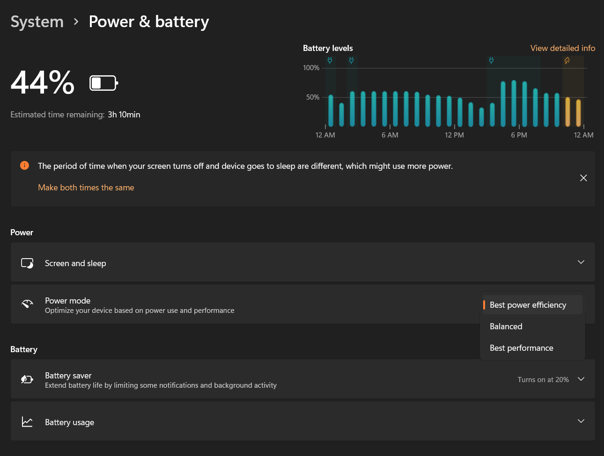
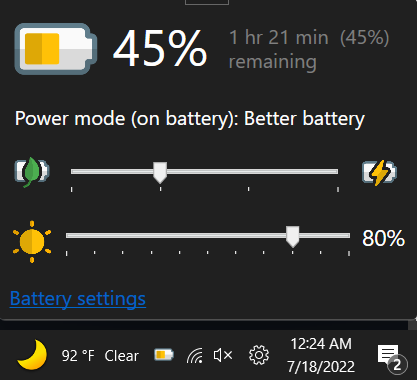
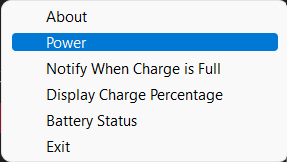

# BatteryIcon
Windows battery icon alternative.

With the official release of Windows 11, the battery, volume, and Wi-Fi icons that were once separate are now consolidated into the 
Windows Action Center. While this makes the controls easy to use and in one place, it makes it significantly harder to customize power modes 
without entering Windows settings and tediously changing it every time you want to optimize for performance or power savings. 

BatteryIcon lives in the Windows Notification Area (often referred to as the "system tray") and is easily accessible from a single click. This application **WILL NOT** work if the standard power mode GUIDs are modified. 

## Usage
- Download and install application using setup file provided in "Releases", 

## Build / Debug
- Clone code into Visual Studio 2022
- If security notification is received, disable it.
- Choose x64 for solution platform otherwise power mode switching will be disabled

## Requirements
- Windows 10 2004 (20H1) or later, fully compatible with Windows 11
- 64 bit Operating System
- .NET Framework 4.7.2 (comes preinstalled with Windows)

## Screenshots

## Features
- Color-coordinated battery indicator displays the same info as the built-in Windows icon
- Battery information and current status
- Can display battery percentage instead of icon
- Adjustable brightness in increments of 10

## NuGet Packages Used
- Microsoft.Toolkit.Uwp.Notifications
- System.Drawing.Common
- System.Threading.Tasks
- UwpDesktop-Updated

## Disclaimer
Using the powrprof.dll's undocumented API is not supported by Microsoft. This application may break in a future Windows release. 
This is not an official application, just an experiment I wanted to create for fun. I am not responsible for any changes to power settings 
that may occur if used in unsupported versions of Windows. Use discretion.

## Credit
This GUI was made possible thanks to Aaron Kelley's detailed guide on the Windows Power Slider's undocumented API.
Check it out here: https://github.com/AaronKelley/PowerMode

## Contributing
I would be very grateful for any pull requests or issues.

